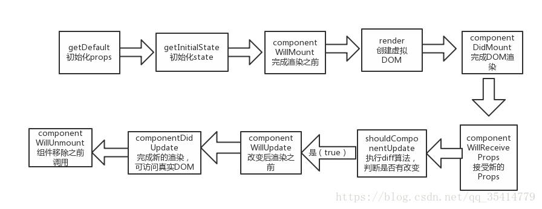

## 1. React 简介

- React 起源于 Facebook 的内部项目，因为该公司对市场上所有 JavaScript MVC 框架，都不满意，就决定自己写一套，用来架设 Instagram（照片交友） 的网站。做出来以后，发现这套东西很好用，**就在 2013 年 5 月开源了**。
- Angular1 2009 年 谷歌 MVC 不支持 组件化开发
- 由于 React 的**设计思想极其独特**，属于革命性创新，性能出众，代码逻辑却非常简单。所以，越来越多的人开始关注和使用，认为它可能是将来 Web 开发的主流工具。
- 清楚两个概念：
  - library（库）：小而巧的库，只提供了特定的 API；优点就是 船小好掉头，可以很方便的从一个库切换到另外的库；但是代码几乎不会改变；
  - Framework（框架）：大而全的是框架；框架提供了一整套的解决方案；所以，如果在项目中间，想切换到另外的框架，是比较困难的；

## 2. 前端三大主流框架

> 三大框架一大抄

- Angular.js：出来**较早**的前端框架，学习曲线比较陡，NG1 学起来比较麻烦，NG2 ~ NG5 开始，进行了一系列的改革，也提供了组件化开发的概念；从 NG2 开始，也支持使用 TS（TypeScript）进行编程；
- Vue.js：**最火**（关注的人比较多）的一门前端框架，它是中国人开发的，对我我们来说，文档要友好一些；
- React.js：**最流行**（用的人比较多）的一门框架，因为它的设计很优秀；

## 3. React 与 Vue 的对比

### 组件化方面

1. **什么是模块化：**是从**代码**的角度来进行分析的；把一些可复用的代码，抽离为单个的模块；便于项目的维护和开发；
2. **什么是组件化：** 是从 **UI 界面**的角度 来进行分析的；把一些可服用的 UI 元素，抽离为单独的组件；便于项目的维护和开发；
3. **组件化的好处**：随着项目规模的增大，手里的组件越来越多；很方便就能把现有的组件，拼接为一个完整的页面；
4. **Vue 是如何实现组件化的**： 通过 `.vue` 文件，来创建对应的组件；
   - template 结构
   - script 行为
   - style 样式

5) **React 如何实现组件化**：大家注意，React 中有组件化的概念，但是，并没有像 vue 这样的组件模板文件；React 中，一切都是以 JS 来表现的；因此要学习 React，JS 要合格；ES6 和 ES7 （async 和 await） 要会用；

### 开发团队方面

- React 是由 FaceBook 前端官方团队进行维护和更新的；因此，React 的维护开发团队，技术实力比较雄厚；
- Vue：第一版，主要是有作者 尤雨溪 专门进行维护的，当 Vue 更新到 2.x 版本后，也有了一个以 尤雨溪 为主导的开源小团队，进行相关的开发和维护；

### 社区方面

- 在社区方面，React 由于诞生的较早，所以社区比较强大，一些常见的问题、坑、最优解决方案，文档、博客在社区中都是可以很方便就能找到的；
- Vue 是近两年才火起来的，所以，它的社区相对于 React 来说，要小一些，可能有的一些坑，没人踩过；

### 移动 APP 开发体验方面

- Vue，结合 Weex 这门技术，提供了 迁移到 移动端 App 开发的体验（Weex，目前只是一个 小的玩具， 并没有很成功的 大案例；）
- React，结合 ReactNative，也提供了无缝迁移到 移动 App 的开发体验（RN 用的最多，也是最火最流行的）；

## 4. 为什么要学习 React

1. 和 Angular1 相比，React 设计很优秀，一切基于 JS 并且实现了组件化开发的思想；
2. 开发团队实力强悍，不必担心断更的情况；
3. 社区强大，很多问题都能找到对应的解决方案；
4. 提供了无缝转到 ReactNative 上的开发体验，让我们技术能力得到了拓展；增强了我们的核心竞争力；
5. 很多企业中，前端项目的技术选型采用的是 React.js；

## 5. React 中几个核心的概念

### 虚拟 DOM（Virtual Document Object Model）

- **DOM 的本质是什么**：浏览器中的概念，用 JS 对象来表示 页面上的元素，并提供了操作 DOM 对象的 API；
- **什么是 React 中的虚拟 DOM**：是框架中的概念，是程序员 用 JS 对象来模拟 页面上的 DOM 和 DOM 嵌套；
- **为什么要实现虚拟 DOM（虚拟 DOM 的目的）**：为了实现页面中， DOM 元素的高效更新
- **DOM 和虚拟 DOM 的区别**：

  - **DOM**：浏览器中，提供的概念；用 JS 对象，表示页面上的元素，并提供了操作元素的 API；

  - **虚拟 DOM**：是框架中的概念；而是开发框架的程序员，手动用 JS 对象来模拟 DOM 元素和嵌套关系；

    - 本质： 用 JS 对象，来模拟 DOM 元素和嵌套关系；
    - 目的：就是为了实现页面元素的高效更新；

    

### Diff 算法

- **tree diff**:新旧两棵 DOM 树，逐层对比的过程，就是 Tree Diff； 当整颗 DOM 逐层对比完毕，则所有需要被按需更新的元素，必然能够找到；

- **component diff**：在进行 Tree Diff 的时候，每一层中，组件级别的对比，叫做 Component Diff；

  - 如果对比前后，组件的类型相同，则**暂时**认为此组件不需要被更新；
  - 如果对比前后，组件类型不同，则需要移除旧组件，创建新组件，并追加到页面上；

- **element diff**：在进行组件对比的时候，如果两个组件类型相同，则需要进行 元素级别的对比，这叫做 Element Diff；

  

## 6. 创建基本的 webpack4.x 项目

1. 运行`npm init -y` 快速初始化项目
2. 在项目根目录创建`src`源代码目录和`dist`产品目录
3. 在 src 目录下创建 `index.html`
4. 使用 cnpm 安装 webpack ，运行`cnpm i webpack webpack-cli -D`
   - 如何安装 `cnpm`: 全局运行 `npm i cnpm -g`
5. 注意：webpack 4.x 提供了 约定大于配置的概念；目的是为了尽量减少 配置文件的体积；
   - 默认约定了：
   - 打包的入口是`src` -> `index.js`
   - 打包的输出文件是`dist` -> `main.js`
   - 4.x 中 新增了 `mode` 选项(为必选项)，可选的值为：`development` 和 `production`;

## 7. 在项目中使用 react

1. 运行 `cnpm i react react-dom -S` 安装包

   - react： 专门用于创建组件和虚拟 DOM 的，同时组件的生命周期都在这个包中
   - react-dom： 专门进行 DOM 操作的，最主要的应用场景，就是`ReactDOM.render()`

2. 在`index.html`页面中，创建容器：

   ```html
   <!--
     容器，将来，使用 React 创建的虚拟DOM元素，都会被渲染到这个指定的容器中
   -->
   <div id="app"></div>
   ```

3. 导入 包：

   ```js
   import React from "react"
   import ReactDOM from "react-dom"
   ```

4. 创建虚拟 DOM 元素：

   ```jsx
   // 这是 创建虚拟DOM元素的 API    <h1 title="啊，五环" id="myh1">你比四环多一环</h1>
   //  第一个参数： 字符串类型的参数，表示要创建的标签的名称
   //  第二个参数：对象类型的参数， 表示 创建的元素的属性节点
   //  第三个参数： 子节点
   const myh1 = React.createElement(
     "h1",
     { title: "啊，五环", id: "myh1" },
     "你比四环多一环"
   )
   ```

5) 渲染：

   ```js
   // 3. 渲染虚拟DOM元素
   // 参数1： 表示要渲染的虚拟DOM对象
   // 参数2： 指定容器,注意：这里不能直接放 容器元素的Id字符串，需要放一个容器的DOM对象
   ReactDOM.render(myh1, document.getElementById("app"))
   ```

   ​

## 8. JSX 语法

> 什么是 JSX 语法：就是符合 xml 规范的 JS 语法；（语法格式相对来说，要比 HTML 严谨很多）

1. **如何启用 jsx 语法？**

   - 安装 `babel` 插件

     - 运行`cnpm i babel-core babel-loader babel-plugin-transform-runtime -D`
     - 运行`cnpm i babel-preset-env babel-preset-stage-0 -D`

   - 安装能够识别转换 jsx 语法的包 `babel-preset-react`

     - 运行`cnpm i babel-preset-react -D`

   - 添加 `.babelrc` 配置文件

     ```json
     {
       "presets": ["env", "stage-0", "react"],
       "plugins": ["transform-runtime"]
     }
     ```

   - 添加 babel-loader 配置项：

     ```js
     module: {
       //要打包的第三方模块
       rules: [
         { test: /\.js|jsx$/, use: "babel-loader", exclude: /node_modules/ }
       ]
     }
     ```

2. **jsx 语法的本质**：并不是直接把 jsx 渲染到页面上，而是 内部先转换成了 createElement 形式，再渲染的；

3. **在 jsx 中混合写入 js 表达式**：在 jsx 语法中，要把 JS 代码写到 `{ }` 中

   - 渲染数字
   - 渲染字符串
   - 渲染布尔值
   - 为属性绑定值
   - 渲染 jsx 元素
   - 渲染 jsx 元素数组
   - 将普通字符串数组，转为 jsx 数组并渲染到页面上【两种方案】

4. **在 jsx 中 写注释**：推荐使用`{ /* 这是注释 */ }`

5. **为 jsx 中的元素添加 class 类名**：需要使用`className` 来替代 `class`；`htmlFor`替换 label 的`for`属性

6. 在 JSX 创建 DOM 的时候，所有的节点，必须有唯一的根元素进行包裹；

7. 在 jsx 语法中，标签必须 成对出现，如果是单标签，则必须自闭和！

> 当 编译引擎，在编译 JSX 代码的时候，如果遇到了`<`那么就把它当作 HTML 代码去编译，如果遇到了 `{}` 就把 花括号内部的代码当作 普通 JS 代码去编译；

## 9. React 中创建组件

### 第 1 种 - 创建组件的方式

> **使用构造函数来创建组件**，如果要接收外界传递的数据，需要在 构造函数的参数列表中使用`props`来接收；
>
> 必须要向外 return 一个合法的 JSX 创建的虚拟 DOM；

- 创建组件：

  ```jsx
  function Hello() {
    // return null
    return <div>Hello 组件</div>
  }
  ```

- 为组件传递数据：

  ```jsx
  // 使用组件并 为组件传递 props 数据
  ;<Hello name={dog.name} age={dog.age} gender={dog.gender} />

  // 在构造函数中，使用 props 形参，接收外界 传递过来的数据
  function Hello(props) {
    // props.name = 'zs'
    console.log(props)
    // 结论：不论是 Vue 还是 React，组件中的 props 永远都是只读的；不能被重新赋值；

    return (
      <div>
        这是 Hello 组件 --- {props.name} --- {props.age} --- {props.gender}
      </div>
    )
  }
  ```

1. 父组件向子组件传递数据

2. 使用{...obj}属性扩散传递数据

3. 将组件封装到单独的文件中

4. 注意：组件的名称首字母必须是大写

5. 在导入组件的时候，如何省略组件的`.jsx`后缀名：

   ```js
   // 打开 webpack.config.js ，并在导出的配置对象中，新增 如下节点：
   resolve: {
       extensions: ['.js', '.jsx', '.json'], // 表示，这几个文件的后缀名，可以省略不写
       alias: {
           '@': path.join(__dirname, './src')
       }
     }
   ```

6. 在导入组件的时候，配置和使用`@`路径符号

### 第 2 种 - 创建组件的方式

> 使用 class 关键字来创建组件
>
> ES6 中 class 关键字，是实现面向对象编程的新形式；

#### 了解 ES6 中 class 关键字的使用

1. class 中 `constructor` 的基本使用
2. 实例属性和实例方法
3. 静态属性和静态方法
4. 使用 `extends` 关键字实现继承

#### 基于 class 关键字创建组件

1. 最基本的组件结构：

   ```jsx
   //如果要使用class定义组件，必须让自己的组件，继承自React.Component
   class 组件名称 extends React.Component {
     //在组件内部，必须有render函数，作用：渲染当前组件对应的虚拟DOM结构
     render() {
       //render函数中，必须返回合法的JSX虚拟DOM结构，render函数也算是class这个类中的实例方法
       //在class关键字创建的组件中，如果使用外界传递过来的 props 参数，不需接收，直接通过 this.props.**** 访问即可
       //注意：在class组件内部，this表示当前组件的实例对象
       return <div>这是 class 创建的组件 -- {this.props.name}</div>
     }
   }
   ```

## 10. 两种创建组件方式的对比

注意：使用 class 关键字创建的组件，有自己的私有数据和生命周期函数；  
注意：但是使用 function 创建的组件，只有 props，没有自己的私有数据和生命周期函数；

1. 用**构造函数**创建出来的组件：叫做“无状态组件”
2. 用**class 关键字**创建出来的组件：叫做“有状态组件”
   - this.state = {} 相当于 Vue 中的 date(){ return { } }，是这个组件中的私有数据，并且可以可读可写。
3. 什么情况下使用有状态组件？什么情况下使用无状态组件？

- 如果一个组件需要有自己的私有数据，则推荐使用：class 创建的有状态组件
- 如果一个组件不需要私有的数据，则推荐使用：无状态组件
- react 官方说：无状态组件，由于没有自己的 state 和声明周期函数，所以运行效率会比有状态组件稍微高一些

> 有状态组件和无状态组件之间的**本质区别**就是：有无 state 属性、和有无生命周期函数

4. 组件中的 props 和 state/data 之间的区别

- props 中的数据都是外界传递过来的
- state/data 中的数据，都是组件私有的；（通过 Ajax 获取回来的数据，一般都是私有数据）
- props 中的数据都是只读的，不能重新赋值；
- state/data 中的数据，都是可读可写的；

## 11. 一个小案例，巩固有状态组件和无状态组件的使用


### 通过 for 循环生成多个组件

1. 数据：

```js
CommentList: [
  { id: 1, user: "张三", content: "哈哈，沙发" },
  { id: 2, user: "李四", content: "哈哈，板凳" },
  { id: 3, user: "王五", content: "哈哈，凉席" },
  { id: 4, user: "赵六", content: "哈哈，砖头" },
  { id: 5, user: "田七", content: "哈哈，楼下山炮" }
]
```

### 设置样式

1. 使用普通的 `style` 样式

   ```jsx
   <h1 style={{ color: "red", fontWeight: 200 }} />
   ```

2. 启用 css-modules

   1. 修改 `webpack.config.js`这个配置文件，为 `css-loader` 添加参数：

      ```js
      { test: /\.css$/, use: ['style-loader', 'css-loader?modules'] } // 为 .css 后缀名的样式表  启用 CSS 模块化
      ```

   2. 在需要的组件中，`import`导入样式表，并接收模块化的 CSS 样式对象：

      ```js
      import cssObj from "../css/CmtList.css"
      ```

   3. 在需要的 HTML 标签上，使用`className`指定模块化的样式：

      ```jsx
      <h1 className={cssObj.title}>评论列表组件</h1>
      ```

3. 使用`localIdentName`自定义生成的类名格式，可选的参数有：

   - [path] 表示样式表 `相对于项目根目录` 所在路径
   - [name] 表示 样式表文件名称
   - [local] 表示样式的类名定义名称
   - [hash:length] 表示 32 位的 hash 值
   - 例子：`{ test: /\.css$/, use: ['style-loader', 'css-loader?modules&localIdentName=[path][name]-[local]-[hash:5]'] }`

4. 使用 `:local()` 和 `:global()`

   - `:local()`包裹的类名，是被模块化的类名，只能通过`className={cssObj.类名}`来使用

     同时，`:local`默认可以不写，这样，默认在样式表中定义的类名，都是被模块化的类名；

   - `:global()`包裹的类名，是全局生效的，不会被 `css-modules` 控制，定义的类名是什么，就是使用定义的类名`className="类名"`

5. 注意：只有`.title`这样的类样式选择器，才会被模块化控制，类似于`body`这样的标签选择器，不会被模块化控制；

### 在项目中启用模块化并同时使用 bootstrap

1. 把 自己的样式表，定义为 `.scss` 文件

2. 第三方的 样式表，还是 以 `.css` 结尾

3. 我们只需要为自己的 `.scss` 文件，启用模块化即可；

4. 运行`cnpm i sass-loader node-sass -D` 安装能够解析`scss`文件的 loader

5. 添加 loader 规则：

   ```json
   {
     "test": /\.scss$/,
     "use": [
       "style-loader",
       "css-loader?modules&localIdentName=[path][name]-[local]-[hash:5]",
       "sass-loader"
     ]
   } // 打包处理 scss 文件的 loader
   ```

## 12. React 中绑定事件的注意点

1. 事件的名称都是 React 的提供的，因此名称的首字母必须大写`onClick`、`onMouseOver`

2. 为事件提供的处理函数，必须是如下格式

   ```
   onClick= { function }
   ```

3. 用的最多的事件绑定形式为：

   ```jsx
   ;<button onClick={() => this.show("传参")}>按钮</button>

   // 事件的处理函数，需要定义为 一个箭头函数，然后赋值给 函数名称
   show = arg1 => {
     console.log("show方法" + arg1)
   }
   ```

4. 在 React 中，如果想要修改 state 中的数据，使用 `this.setState({ })`

    - 在`setState({ })`中，只会把对应的 `state` 状态更新，而不会覆盖其它的 `state` 状态。
    - `this.setState({ })`方法是异步的，所以如果想拿到最新的值，需要在它自带的回调函数里面拿到值。即：`this.setState({ },callback`

## 13. 绑定文本框与state中的值（单向数据流）

1. 在 Vue 中，默认提供了`v-model`指令，可以很方便的实现 `数据的双向绑定`；

2. 但是，在 React 中，默认只是`单向数据流`，也就是 只能把 state 上的数据绑定到 页面，无法把 页面中数据的变化，自动同步回 state ； 如果需要把 页面上数据的变化，保存到 state，则需要程序员手动监听`onChange`事件，拿到最新的数据，手动调用`this.setState({  })` 更改回去；

3. 案例：

   ```jsx
   <input type="text" style={{ width: '100%' }} value={this.state.msg} onChange={() => this.textChanged()} ref="mytxt" />

    // 响应 文本框 内容改变的处理函数
     textChanged = () => {
       // console.log(this);
       // console.log(this.refs.mytxt.value);
       this.setState({
         msg: this.refs.mytxt.value
       })
     }
   ```

   ​

## 14. 使用ref获取DOM元素引用

和 Vue 中差不多，vue 为页面上的元素提供了 `ref` 的属性，如果想要获取 元素引用，则需要使用`this.$refs.引用名称`

在 React 中，也有 `ref`, 如果要获取元素的引用`this.refs.引用名称`  

## 15. React 生命周期函数



  * getDefaultProps
    * 作用于组件类，只调用一次，返回对象用于设置默认的props，对于引用值，会在实例中共享。
  * getInitialState
    * 作用于组件的实例，在实例创建时调用一次，用于初始化每个实例的state，此时可以访问this.props
  * componentWillMount
    * 在完成首次渲染之前调用，此时仍可以修改组件的state
  * render
    必选的方法，创建虚拟DOM，该方法具有特殊的规则：
      * 只能通过this.props和this.state访问数据
      * 可以返回null、false或任何react组件
      * 只能出现一个顶级组件（不能返回数据）
      * 不能改变组件的状态
      * 不能修改DOM的输出
  * componentDidMount
      真实的DOM被渲染出来后调用，在该方法中可通过this.getDOMNode()访问到真实的DOM元素。此时已可以使用其他类库来操作这个DOM。
  * componentWillReceiveProps （参数：nextProps）
      组件接收到新的props时调用，并将其作为参数nextProps使用，此时可以更改组件的props及state
      ```JS
      componentWillReceiveProps(nextProps){
        if(nextProps.bool){
          this.setState({
            bool.true
          })
        }
      }
      ```
  * shouldComponentUpdate （参数：nextProps,nextState）  
      组件是否应当渲染新的props或state，返回false表示跳过后续的生命周期方法（及时数据进行的新的变化，也不会进行渲染），通常不需要使用以避免出现bug。在出现应用的瓶颈时，可通过该方法进行适当的优化。  
      在首次渲染期间（只有触发了props或state更新才会调用）或者调用了forceUpdate方法后，该方法不会被调用。
  * componentWillUpdate （参数：nextProps,nextState）  
      接收到新的props或者state后，进行渲染之前调用，此时不允许更新props或state。
  * componentDidUpdate （参数：prevProps,prevState）  
      ß完成渲染新的props或者state后调用，此时可以访问到新的DOM元素。
  * componentWillUnmount  
      组件被移除之前被调用，可以用于做一些清理工作，在componentDidMount方法中添加的所有任务都需要在该方法中撤销，比如创建的定时器或添加的事件监听器。


------------------------------------------------------------------------------------------------------------

## React常用插件：

1. `react-document-title`：媒体查询，响应式组件  
2. `react-document-title`：设置页面浏览器标题  
3. `react-d3-cloud`：词云  

    

  
