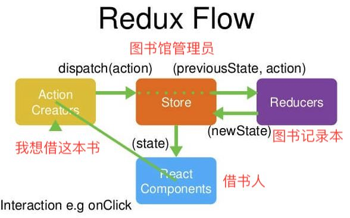

# Redux  

 

> 组件就相当于是个*借书的人*，他需要借一本*书 (state)*，所以他必须跟*图书管理员 （store)*说*我要借一本书*，这句话就代表了*Action*，*图书管理员*就相当于是*store*，他也不知道书在哪里，所以需要去翻看*图书记录本 (reducer)*，然后*图书记录本 (reducer)*告诉他书的位置，然后*图书管理员 (store)*再给*书 (state)*给借书的人

什么时候需要用redux?  

        某个组件的状态，需要共享
        某个状态需要在任何地方都可以拿到
        一个组件需要改变全局状态
        一个组件需要改变另一个组件的状态  

设计思想：  

（1）Web 应用是一个状态机，视图与状态是一一对应的。

（2）所有的状态，保存在一个对象里面。

## 安装

```js
npm i redux react-redux redux-thunk
```

redux-thunk：是 redux 中间件

## 步骤

> 因为 redux 是用于集中管理 state 的，所以怎么把分散的组件管理到一起呢？  
> 这个时候就需要一个容器来包裹住根组件，这个容器就是`<Provider></Provider>`

1. 用`<Provider></Provider>`包裹住 App 组件

```js
import { Provider } from 'react-redux';

<Provider>
    <div className="App">
        ...
    </div>
</Provider>;
// Provider在根组件外面包了一层，这样一来，App的所有子组件就默认都可以拿到state了
```
> 有容器还不够，还需要这个容器可以保存状态才行，所以我们要创建`store`，*整个应用有且只有一个store* 

2. 创建`store`

`createStore` 是创建store的方法，它包含三个参数（reducer函数,初始状态state,中间件函数）

```js
import { createStore, applyMiddleware } from 'redux';

const initialState = {}
const store = createStore(()=>[],initialState,applyMiddleware())
class App extends Component {
    render() {
        return (
            <Provider store={store}>
                <div className="App">
                    ....
                </div>
            </Provider>
        );
    }
}

export default App;

```

> 一般来说，管理状态最好有一个单独的JS文件来进行，所以我们要进行代码抽离

3. 在`src`文件夹下，新建一个`store.js`

```js

//store.js
import { createStore, applyMiddleware } from 'redux';

//redux-thunk 是redux中间件，引入
import thunk from 'redux-thunk'

const initialState = {}
const middleware = [thunk]
const store = createStore(()=>[],initialState,applyMiddleware(...thunk))

```
